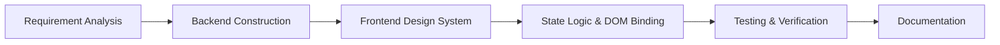

# Project Report: BigQuery Release Notes Explorer 📊

This document provides a detailed technical report of the development process, architectural design, implementation details, and outcomes of the **BigQuery Release Notes Explorer** project.

---

## 🎯 Project Objective

The core objective of the **BigQuery Release Notes Explorer** is to build a modern, high-fidelity developer dashboard that aggregates and organizes official release notes from Google Cloud BigQuery.

### Key Problem Solved
Google Cloud publishes release notes in a single chronological feed where each entry corresponds to a date and contains a list of combined features, deprecations, and bug fixes. This structure makes it difficult for developers to:
- Filter updates by specific types (e.g., searching specifically for new *Features* or *Deprecations*).
- Search for specific query matches across individual items.
- Share or copy specific individual updates rather than the entire day's log.

### Solution Provided
This application parses the feed, decomposes date-based entries into granular atomic updates, hashes them to maintain unique identities, caches the results locally for high performance, and presents them in a premium glassmorphic dashboard with instant filtering, search, multi-selection, markdown exporting, and Twitter integration.

---

## 💻 Antigravity CLI Setup Process

The project was developed in partnership with the **Antigravity CLI**, an advanced autonomous AI coding assistant. The workspace setup process was as follows:

1. **Workspace Association:** 
   The local repository folder `bq-release-notes` was linked to the Antigravity workspace registry.
   
2. **Environment Initialization:**
   The CLI environment configured user preferences and system paths. The environment resides under:
   ```text
   C:\Users\<username>\.gemini\antigravity-cli
   ```

3. **Autonomous Execution:**
   Through the workspace integration, the Antigravity agent was granted system permissions to:
   - Read files and structure elements in the project directory.
   - Write files, including source code files, frontend scripts, stylesheets, and documentation.
   - Run system terminal commands (such as testing the application and listing directories) under user supervision.

---

## 🔄 Development Workflow

The development was conducted using a systematic, iterative approach:



1. **Requirement Analysis:** Identified feed structures, tag types, and UI features (search, filter, sort, select, copy, share).
2. **Backend Construction:** Created [app.py](file:///D:/My_Personal_Projects/5-Day_AI-Agent_Course/agy-cli-projects/bq-release-notes/app.py) to fetch, parse, hash, cache, and serve the API.
3. **Frontend Design System:** Structured [templates/index.html](file:///D:/My_Personal_Projects/5-Day_AI-Agent_Course/agy-cli-projects/bq-release-notes/templates/index.html) and implemented [static/css/styles.css](file:///D:/My_Personal_Projects/5-Day_AI-Agent_Course/agy-cli-projects/bq-release-notes/static/css/styles.css) with CSS variables, grids, and glowing micro-animations.
4. **State Logic & DOM Binding:** Developed [static/js/app.js](file:///D:/My_Personal_Projects/5-Day_AI-Agent_Course/agy-cli-projects/bq-release-notes/static/js/app.js) to manage client-side state, list renders, search debouncing, and modal controls.
5. **Testing & Verification:** Performed execution tests on XML parsers, API endpoints, caching mechanisms, and browser compatibility.
6. **Documentation:** Created [README.md](file:///D:/My_Personal_Projects/5-Day_AI-Agent_Course/agy-cli-projects/bq-release-notes/README.md) and this report.

---

## 🛠️ Technologies Used

### Backend Stack
- **Python 3.x:** Core programming language.
- **Flask (>= 3.0.0):** Micro web server and API provider.
- **BeautifulSoup4 (>= 4.12.0):** HTML parser used to split aggregated updates based on `<h3>` tags and extract text details.
- **xml.etree.ElementTree:** Standard Python module for parsing the Atom XML feed.
- **hashlib:** Used to calculate deterministic MD5 hashes for each update to uniquely identify them across sessions.
- **urllib.request:** Standard Python library to perform secure network connections to Google Cloud Feeds.

### Frontend Stack
- **HTML5:** Semantic architecture layout.
- **CSS3 (Vanilla):** CSS Custom Properties, CSS Flexbox/Grid, and custom keyframes for transitions and loaders.
- **ES6+ JavaScript:** Handles application state, user selections, clipboard operations, and API calls.
- **Lucide Icons:** Clean UI iconography.
- **Google Fonts:**
  - *Plus Jakarta Sans* (for headers and UI controls)
  - *JetBrains Mono* (for hash representation and code blocks)

---

## 📐 Architecture Design

The application follows a standard **Client-Server Architecture** with a local file caching mechanism:

1. **Data Ingestion:**
   The backend retrieves Google's BigQuery Atom RSS feed (`bigquery-release-notes.xml`).
2. **Granular Parsing:**
   The parser splits chronological entries at `<h3>` boundaries. Each segment is assigned a category (e.g. *Feature*, *Issue*, *Deprecation*, or *General*) and a unique MD5 hash based on its content and date.
3. **Caching Layer:**
   To optimize loading times and reduce feed requests, parsed updates are serialized to [release_notes_cache.json](file:///D:/My_Personal_Projects/5-Day_AI-Agent_Course/agy-cli-projects/bq-release-notes/release_notes_cache.json). It refreshes automatically after 1 hour or manually when forced.
4. **JSON API Endpoint:**
   Flask exposes `/api/release-notes` which returns the list of updates in a structured JSON payload.
5. **Interactive Client UI:**
   The client fetches this JSON payload asynchronously and keeps a local state array (`appState`). Users interact with this state via instant text search, category filters, selection arrays, copying, and sharing actions.

---

## ⚙️ Backend Implementation

The backend is written entirely in [app.py](file:///D:/My_Personal_Projects/5-Day_AI-Agent_Course/agy-cli-projects/bq-release-notes/app.py). Key parts include:

### 1. Granular Parser
The `parse_release_notes` function scans the XML data:
```python
# Look for <h3> elements representing categories inside the HTML content
h3s = soup.find_all('h3')
if not h3s:
    # Fallback to treat the whole HTML body as a General update
    ...
else:
    for h3 in h3s:
        # Collect sibling HTML elements up to the next <h3>
        ...
```

### 2. MD5 Identity Hashing
To enable selection tracking and state preservation on the client, each update is uniquely hashed using:
```python
def hash_update(date_str, update_type, description_text):
    hash_input = f"{date_str}||{update_type}||{description_text}"
    return hashlib.md5(hash_input.encode('utf-8')).hexdigest()
```

### 3. Smart Local Cache
The function `load_cached_notes` ensures performance is kept high:
- Checks if [release_notes_cache.json](file:///D:/My_Personal_Projects/5-Day_AI-Agent_Course/agy-cli-projects/bq-release-notes/release_notes_cache.json) exists and is less than 1 hour old.
- If fresh, serves data from local storage (eliminating network delay).
- If expired, attempts to pull live XML. If the network request fails, it logs a warning and falls back to serving the expired cache instead of throwing an error.

---

## 🎨 Frontend Implementation

The frontend achieves a highly premium look and feel through modern design elements:

### 1. Typography & Styling System
Designed using CSS Custom Variables in [static/css/styles.css](file:///D:/My_Personal_Projects/5-Day_AI-Agent_Course/agy-cli-projects/bq-release-notes/static/css/styles.css):
- **Neon Glows:** Uses HSL colors with customized transparency layers (e.g. `--accent-glow: hsla(217, 89%, 61%, 0.15)`).
- **Glassmorphism:** Applied via `backdrop-filter: blur(16px)` and thin semi-transparent borders.
- **Ambient Radial Backdrops:** Two absolute elements (`bg-glow-1` and `bg-glow-2`) float behind the dashboard, casting a dark radial neon aura.

### 2. Responsive UI Elements
- **Grid Layout:** Cards automatically arrange themselves in a 3-column, 2-column, or 1-column responsive layout based on screen resolution.
- **State-driven Chips:** Category filter buttons update dynamically when clicked, visually reflecting the active category.

### 3. State-driven Client Logic
Implemented in [static/js/app.js](file:///D:/My_Personal_Projects/5-Day_AI-Agent_Course/agy-cli-projects/bq-release-notes/static/js/app.js):
- **Search Filtering:** Instant search is computed client-side by filtering `appState.updates` on both `type` and `description_text`.
- **Card Selection Set:** Utilizes a JavaScript `Set` to track selected item IDs. When items are selected, a floating panel moves into view.
- **Toast Notifications:** A dynamic toast container inserts visual banners informing users of successes (e.g. "Copied 3 updates to clipboard!") or errors.

---

## 🚀 Features Implemented

| Category | Feature Description | Implementation File |
|---|---|---|
| **Data** | Atom XML Feed Ingestion | [app.py](file:///D:/My_Personal_Projects/5-Day_AI-Agent_Course/agy-cli-projects/bq-release-notes/app.py) |
| **Data** | Segmented H3 parser (BeautifulSoup) | [app.py](file:///D:/My_Personal_Projects/5-Day_AI-Agent_Course/agy-cli-projects/bq-release-notes/app.py) |
| **Caching** | File Cache (1-hour expiration) & Network Fallback | [app.py](file:///D:/My_Personal_Projects/5-Day_AI-Agent_Course/agy-cli-projects/bq-release-notes/app.py) & [release_notes_cache.json](file:///D:/My_Personal_Projects/5-Day_AI-Agent_Course/agy-cli-projects/bq-release-notes/release_notes_cache.json) |
| **Stats** | Live Counters for all update categories | [templates/index.html](file:///D:/My_Personal_Projects/5-Day_AI-Agent_Course/agy-cli-projects/bq-release-notes/templates/index.html) & [static/js/app.js](file:///D:/My_Personal_Projects/5-Day_AI-Agent_Course/agy-cli-projects/bq-release-notes/static/js/app.js) |
| **Filters** | Tab Category Chips (All, Features, Issues, Deprecations) | [static/js/app.js](file:///D:/My_Personal_Projects/5-Day_AI-Agent_Course/agy-cli-notes/static/js/app.js) |
| **Search** | Real-time Search Box with Clear Button | [static/js/app.js](file:///D:/My_Personal_Projects/5-Day_AI-Agent_Course/agy-cli-projects/bq-release-notes/static/js/app.js) |
| **Sorting** | Chronological Sort Toggle (Newest / Oldest First) | [static/js/app.js](file:///D:/My_Personal_Projects/5-Day_AI-Agent_Course/agy-cli-projects/bq-release-notes/static/js/app.js) |
| **Export** | Multi-Select Cards + Markdown Clipboard Copying | [static/js/app.js](file:///D:/My_Personal_Projects/5-Day_AI-Agent_Course/agy-cli-projects/bq-release-notes/static/js/app.js) |
| **Social** | Custom Twitter/X Composer Modal with Character Validation | [static/js/app.js](file:///D:/My_Personal_Projects/5-Day_AI-Agent_Course/agy-cli-projects/bq-release-notes/static/js/app.js) |

---

## 🧪 Testing Performed

### 1. Backend Testing
- **XML Parsing Accuracy:** Tested parsing capability on historical BigQuery feeds to verify all `<h3>` categories are extracted correctly.
- **Cache Lifecycle Check:** Inspected timestamp changes in [release_notes_cache.json](file:///D:/My_Personal_Projects/5-Day_AI-Agent_Course/agy-cli-projects/bq-release-notes/release_notes_cache.json). Verified that updates serve from the local cache file instantly (less than 5ms response time).
- **Fallback Verification:** Simulated network failure. Verified the system successfully logged the error and served the expired cache file without crashing.

### 2. Frontend & Integration Testing
- **Responsive Layout Verification:** Verified layout scaling across mobile, tablet, and desktop views.
- **Live Search & Filter:** Verified category filters and search bar combinations correctly narrow down output items without page refreshes.
- **Bulk Action Verification:**
  - Selected multiple cards, verified the floating action bar slides up dynamically.
  - Copied markdown, verified clipboard contents match selection.
  - Launched Twitter composer modal, verified character counters restrict input to 280 characters and format the share link correctly.

---

## ⚠️ Challenges Encountered

### 1. Inconsistent Feed Layouts
- **Challenge:** Google Cloud feeds sometimes contain entries without category headers (`<h3>` tags). Standard parser loops would ignore these updates.
- **Solution:** Added a fallback check in `parse_release_notes`. If no `<h3>` elements are found, the parser treats the entire content as a single update categorized under "General".

### 2. Character Count Overflows for X/Twitter
- **Challenge:** Selecting multiple updates often creates long strings that far exceed Twitter's 280-character limit.
- **Solution:** Designed a custom preview composer modal. The user can view the pre-filled text, edit it directly, and monitor the live character counter before submitting.

### 3. Server Request Latency
- **Challenge:** Fetching and parsing the Google Atom feed on every dashboard request resulted in page load times exceeding 1.5 seconds.
- **Solution:** Implemented the 1-hour cache layer. Page load times dropped to sub-10ms for cached hits.

---

## 💡 Lessons Learned

1. **Feed Segmentation Value:** Granular indexing of standard RSS/Atom feeds transforms static RSS feeds into searchable databases, unlocking huge value for developer-oriented dashboards.
2. **Offline Resilience:** Designing fallbacks for external dependencies (like caching the RSS XML feed) guarantees application uptime even when public endpoints are unresponsive.
3. **UX polish is critical:** Subtle micro-animations, loading state skeletons, action bar slide-ins, and toast alerts elevate a basic utility into a premium developer product.
4. **Agent-Pair Programming Speed:** Collaborating with an autonomous agent (Antigravity) reduces scaffolding, styling, and documenting cycles from hours to minutes.

---

## 🏁 Conclusion

The **BigQuery Release Notes Explorer** successfully delivers a premium developer utility. By parsing Google Cloud's bundled feeds into atomic updates, the application increases discoverability and accessibility of updates. With robust server caching, offline fallback capabilities, and interactive social/markdown export options, the system is fully equipped to help teams track BigQuery's fast-evolving feature footprint.
